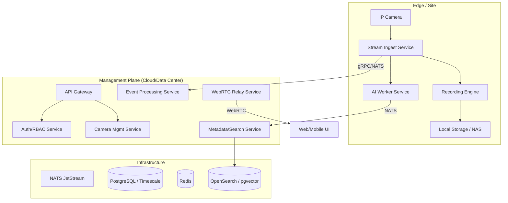

# DAM VMS: High-Level System Architecture

## 1. Overview
DAM VMS is a distributed, cloud-native Video Management System designed for extreme scalability and AI-driven intelligence.

## 2. Component Diagram

## 3. Key Services

### 3.1 Stream Ingest Service (Go)
- Handles RTSP/ONVIF ingestion.
- Performs stream health monitoring.
- Provides raw streams to the Recorder and AI Workers.

### 3.2 Recording Engine (Go)
- Manages circular buffers.
- Writes fragmented MP4/MKV to storage.
- Indexes recordings into the database.

### 3.3 AI Analytics Service (Python/Go)
- Orchestrates AI jobs.
- Manages model lifecycle.
- Processes object detection, tracking, and classification.

### 3.4 WebRTC Service (Go)
- Acts as a signaling and STUN/TURN server.
- Provides low-latency live streams to clients via Pion WebRTC.

### 3.5 Event Processing Service (Go)
- Correlates triggers from cameras and AI.
- Executes notification rules (Email, Webhook, Mobile Push).

## 4. Scalability Strategy
- **Horizontal Scaling:** All services are stateless except the Recorder (which binds to storage).
- **Sharding:** Ingest nodes are sharded by camera/site.
- **Federation:** Multiple "Management Planes" can be federated for global visibility.
